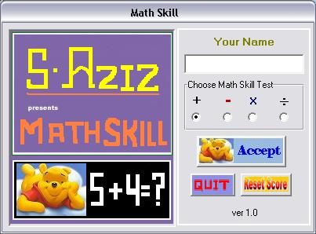



## Math Skill Test

### Description

This is math skill improvements game for kids from grade 2 to grade 6.
 
### More Info
 
The details have been included in Readme.txt file for playing the game.

             |
---                |---
**Submitted On**   |2009-07-28 22:10:30
**By**             |[Sayed Aziz](https://github.com/Planet-Source-Code/PSCIndex/blob/master/ByAuthor/sayed-aziz.md)
**Level**          |Advanced
**User Rating**    |5.0 (10 globes from 2 users)
**Compatibility**  |VB 6\.0
**Category**       |[Games](https://github.com/Planet-Source-Code/PSCIndex/blob/master/ByCategory/games__1-38.md)
**World**          |[Visual Basic](https://github.com/Planet-Source-Code/PSCIndex/blob/master/ByWorld/visual-basic.md)
**Archive File**   |[Math\_Skill2158777292009\.zip](https://github.com/Planet-Source-Code/sayed-aziz-math-skill-test__1-72322/archive/master.zip)

